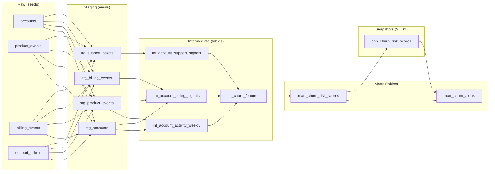

# Churn Early-Warning Platform

B2B SaaS churn prediction pipeline built in **Snowflake + dbt**. Scores every account weekly, outputs a `risk_tier` (HIGH / MEDIUM / LOW), and surfaces high-risk accounts for downstream Slack/email alerts before renewal.

> Portfolio project demonstrating dbt layered architecture, incremental models, SCD2 snapshots, and rule-based ML-ready scoring. No live Snowflake connection required — runs locally via DuckDB.

---

## Architecture



### Scoring weights

| Component | Weight | Signals |
|---|---|---|
| Usage | 45% | WAU trend, active user ratio, feature breadth, recency |
| Commercial | 30% | Days to renewal, seat utilization, payment failures, downgrades |
| Support | 25% | P1/P2 ticket volume, open backlog, resolution time |

**Risk thresholds:** HIGH ≥ 70 · MEDIUM 40–69 · LOW < 40

---

## Quick start (DuckDB local dev)

### Prerequisites

```bash
pip install dbt-duckdb dbt-utils duckdb
```

### Run

```bash
# 1. Install dbt packages
dbt deps

# 2. Load seed data (synthetic accounts, events, billing, tickets)
dbt seed

# 3. Run all models
dbt run

# 4. Capture risk score history (SCD2 snapshot)
dbt snapshot

# 5. Re-run alerts to pick up snapshot data
dbt run --select mart_churn_alerts

# 6. Run tests
dbt test

# 7. Dry-run Slack alert
python scripts/notify_slack.py --db dev.duckdb --dry-run
```

### Expected DAG lineage

```
stg_accounts, stg_product_events
    → int_account_activity_weekly
        → int_churn_features (+ support + billing signals)
            → mart_churn_risk_scores
                → snp_churn_risk_scores (snapshot)
                → mart_churn_alerts
```

---

## Project structure

```
churn-early-warning-platform/
├── models/
│   ├── staging/          # Thin rename/cast views over raw sources
│   ├── intermediate/     # Business logic: usage spine, support, billing, feature set
│   └── marts/            # Scoring + alerts — consumed by downstream tools
├── snapshots/            # SCD2 history of risk score changes
├── seeds/                # Synthetic CSV data for local dev/testing
├── scripts/
│   └── notify_slack.py   # Weekly Slack digest (reads mart_churn_alerts)
├── tests/generic/        # Custom generic tests
├── dbt_project.yml
├── profiles.yml          # DuckDB dev + Snowflake prod
└── packages.yml          # dbt-utils
```

---

## Key design decisions

**Weekly granularity** — reduces noise in B2B usage patterns vs daily.

**4-week rolling window** — primary usage baseline balances recency with signal stability.

**Account × week spine** — generated from `stg_accounts × range(12)` so zero-usage weeks are explicit rows, not gaps. Without this, window functions silently skip dormant accounts.

**Incremental on `int_account_activity_weekly`** — unique key `(account_id, week_start)`, 13-week lookback filter on incremental runs to recompute rolling averages correctly.

**SCD2 snapshot** — `snp_churn_risk_scores` captures tier/score changes over time. Powers `consecutive_high_weeks` (current HIGH streak length) and `first_alerted_at` (when did this account first go HIGH?) in `mart_churn_alerts`.

**Rule-based scoring (ML upgrade planned)** — current weights are business-logic driven. Logistic regression / gradient boosting is a drop-in replacement at the `int_churn_features` → scoring layer.

---

## Snowflake production

Update `profiles.yml` with real credentials and run:

```bash
dbt run --target prod
dbt snapshot --target prod
```

Syntax differences (DuckDB → Snowflake) are documented inline in each model.

---

## Roadmap

| Session | Status | Deliverables |
|---|---|---|
| 1 | ✅ Done | Architecture, usage spine, scoring model |
| 2 | ✅ Done | Real support + billing signal models |
| 3 | ✅ Done | Seeds, schema tests, Slack notification script |
| 4 | ✅ Done | SCD2 snapshot, alert history columns, README |
| 5 | 🔲 Planned | Dashboard (Evidence.dev or HTML) |
| 6 | 🔲 Planned | ML upgrade: logistic regression on feature set |
